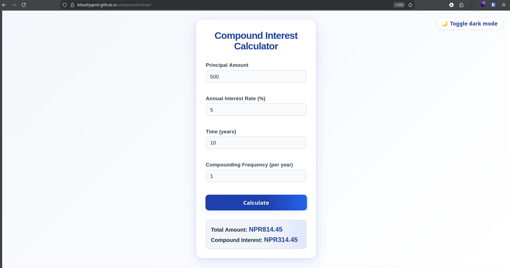

# Compound Interest Calculator

A modern, responsive Compound Interest Calculator web app built with HTML, CSS, and JavaScript. Features a professional UI, dark mode, and is fully accessible and mobile-friendly. Perfect for finance learners, students, and as a portfolio project.



## Features

- 📱 Responsive, mobile-first design
- 🌙 Dark mode toggle with smooth transitions
- 🧮 Calculates total amount and compound interest
- 🛡️ Input validation and accessibility
- ⚡ Fast, lightweight, and no dependencies
- 🏆 Portfolio-ready, clean code and SEO meta tags

## Demo

[View Live on GitHub Pages](https://bibashjaprel.github.io/compound-intrest/)

## Usage

1. **Clone this repository:**
   ```bash
   git clone https://github.com/bibashjaprel/compound-intrest.git
   ```
2. **Open `index.html` in your browser** or deploy to GitHub Pages.

## How It Works

- Enter the principal, annual interest rate, time (years), and compounding frequency.
- Click **Calculate** to see the total amount and compound interest.
- Use the 🌙/☀️ button to toggle dark mode. Your preference is saved.

## Code Structure

- `index.html` – Semantic HTML, SEO meta tags, and accessibility
- `style.css` – Modern, responsive, and dark mode styles
- `app.js` – Modular JavaScript with comments and clean logic

## SEO & Social

- Includes Open Graph and meta tags for better sharing and discoverability.

## License

MIT License. Free to use, modify, and share.

---
